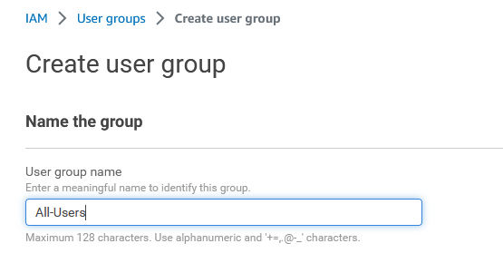
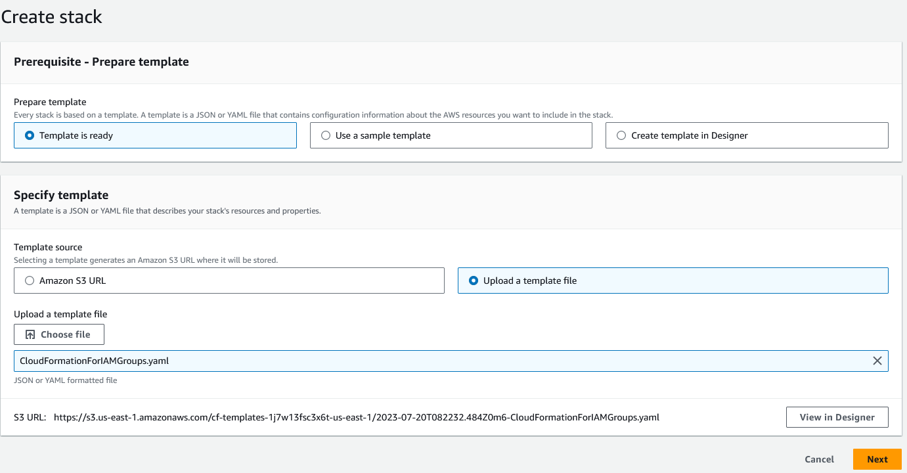
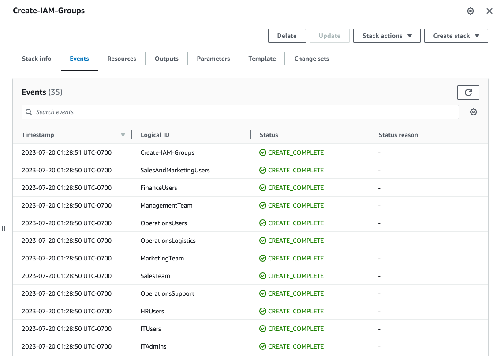

# Setup

* For simplicity, I'll be creating the groups in IAM. There are additional features in the new IAM Identity Center, mostly tied around federation.
* The list of user groups to be added will are located [here](User-Groups.MD)
* Groups will be created first, and then assigned to users as they are created.
* No permissions policies will be applied to groups at this time. I will be dynamically adjusting permissions policies as needed in future projects.

# Create the first group in the IAM Console

First, I'll create the **All-Users** group in the IAM console. 

# Create the second group using CLI

Next, I'll create the **Executives** group using a basic CLI command

    $ aws iam create-group --group-name Executives

If the command runs successfully, it will show output similar to below:

    {
        "Group": {
            "Path": "/",
            "GroupName": "Executives",
            "GroupId": "AGPARZ2NU2R52AE6Q74LI",
            "Arn": "arn:aws:iam::************:group/Executives",
            "CreateDate": "2023-07-20T06:58:48+00:00"
        }
    }

# Create the remaining groups using CloudFormation

Prior to creating a CloudFormation Stack, an IAM policy and role will need to be created to allow CloudFormation to List, Read and Write to IAM.

Once the Policy and Role is set up, Create the stack and upload the yaml template and then complete the wizard:

Once the stack has been created, view the progress in the CloudFormation Console

# Confirm Groups Added to IAM

Once the CloudFormation Stack has run, return to IAM and ensure the groups have been created.

